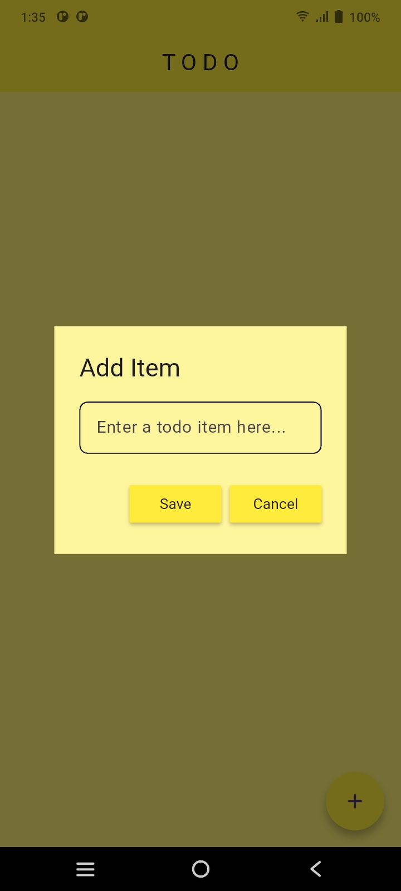

# ✅ Todo Master - Flutter Task Manager

A beautiful and intuitive todo app built with Flutter to help you stay organized.

## 📱 Screenshots

| Home Screen | Add New Todo | Mark Complete | Delete Todo |
|-------------|--------------|---------------|-------------|
|  |  |  |  |

## ✨ Features

- **Add tasks** with titles, descriptions and due dates
- **Mark tasks** as complete/incomplete
- **Delete tasks** with swipe gestures
- **Beautiful UI** with light/dark mode support
- **Local persistence** to save your tasks

## 🛠️ Tech Stack

- **Flutter** - Cross-platform framework
- **Hive** - Fast local database
- **Swipe to Delete** - Gesture controls

## 🚀 Installation

```bash
# Clone the repository
git clone https://github.com/yourusername/todo-app.git

# Install dependencies
flutter pub get

# Run the app
flutter run